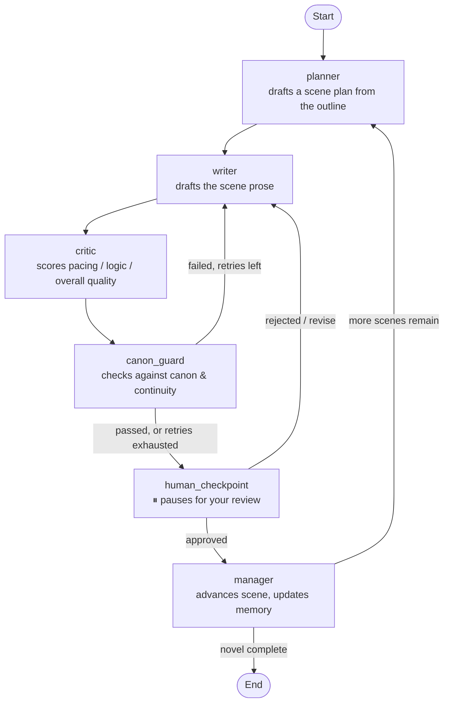

# Novel Generation Pipeline

A multi-agent, human-in-the-loop novel writing pipeline built with [LangGraph](https://github.com/langchain-ai/langgraph) and Google Gemini. Feed it a structured story outline and it drafts your novel scene by scene — planning, writing, critiquing, and canon-checking each one automatically, pausing for your approval at every step, and remembering what's already happened so later scenes stay consistent with earlier ones.

## How it works

Each scene passes through a chain of specialized agents before it's ever written to the manuscript:



- **`planner`** — reads the current scene's brief from your outline and produces a structured scene plan (goal, characters, location, conflict, what's revealed).
- **`writer`** — drafts the actual prose for the scene, using the plan, canon rules, character roster, recent scene text, and a running continuity ledger.
- **`critic`** — scores the draft (pacing, logic, overall) and rejects anything below the quality threshold.
- **`canon_guard`** — checks the draft against your story's canon ledger, character roster, continuity, and negative constraints — separately from prose quality.
- **`human_checkpoint`** — execution genuinely pauses here (via LangGraph's `interrupt_before`) so you can read the draft and approve, reject, or request a revision with notes.
- **`manager`** — on approval, advances to the next scene, appends the approved prose to your rolling story memory, and extracts any new continuity facts the scene established.

A scene that fails `critic`/`canon_guard` gets sent back to `writer` with the specific feedback attached, up to a retry limit — after which it's forced to the human checkpoint rather than looping forever, so you always get the final say on anything the automated checks can't resolve.

## Features

- **Structured, canon-driven generation** — the whole story lives in one `outline.json`: premise, characters, canon ledger, immutable rules, per-scene briefs, and prose style. The pipeline drafts against that spec rather than freewheeling.
- **Human-in-the-loop by design** — every scene pauses for your approval before it's written to the manuscript. You can approve, reject, or send it back with specific revision notes.
- **Persistent, resumable runs** — progress is checkpointed to SQLite (`langgraph-checkpoint-sqlite`), so you can stop and resume a long novel generation run at any point, including mid-checkpoint.
- **Growing continuity memory** — a rolling context, verbatim recent-scene text, and a dynamically-extracted continuity ledger are all fed back into the writer, so later scenes stay consistent with what's actually been written (not just what was planned).
- **Bounded automatic retries** — scenes that fail quality or canon checks are automatically rewritten with specific feedback, up to a configurable retry limit, before requiring human input.
- **Multi-language output** — set `prose_style.language` in your outline to draft the novel in any language (English, Bengali, etc.) while all rules/canon data stay in English.
- **Optional LangSmith tracing** — flip on `LANGCHAIN_TRACING_V2` to get a full, searchable trace of every node, prompt, and LLM call per chapter.
- **Resilient LLM calls** — automatic retry/backoff for rate limits, server overload, and transient connection drops.

## Project structure

```
.
├── main.py                 # Entry point — loads the outline, runs the graph, handles checkpoints
├── graph.py                 # LangGraph StateGraph definition and routing logic
├── state.py                  # NovelState — the shared state passed between nodes
├── config.py                 # LLM setup (Gemini heavy/light), retry logic, LangSmith bootstrap
├── db.py                     # SQLite store for character data (audit log)
├── node/
│   ├── planner.py             # Scene planning node
│   ├── writer.py               # Prose drafting node
│   ├── critic.py                # Quality scoring node
│   ├── canon_guard.py            # Canon/continuity compliance node
│   ├── human_checkpoint.py        # Pass-through node where execution pauses
│   └── manager.py                  # Scene advancement + continuity memory node
├── prompts/
│   ├── planner.py              # PLANNER_PROMPT
│   ├── writer.py                 # WRITER_PROMPT
│   ├── critic.py                   # CRITIC_PROMPT
│   ├── canon_guard.py                # CANON_GUARD_PROMPT
│   └── fact_extractor.py               # FACT_EXTRACTOR_PROMPT
├── outline.json              # Your story's full outline (see "Writing an outline" below)
├── template.json              # Blank outline template to copy for a new story
├── requirements.txt
├── _env                        # Environment variables (rename to .env)
└── generated_novel.md           # Output — approved scenes are appended here as they're written
```

## Prerequisites

- Python 3.10+
- A Google AI Studio / Gemini API key ([get one here](https://aistudio.google.com/app/apikey))
- (Optional) A [LangSmith](https://smith.langchain.com) API key, if you want tracing

## Installation

```bash
git clone <your-repo-url>
cd <your-repo-directory>
python -m venv venv
source venv/bin/activate   # On Windows: venv\Scripts\activate
pip install -r requirements.txt
```

## Configuration

Rename `_env` to `.env` (or create one) and fill in your keys:

```env
GOOGLE_API_KEY=your-google-api-key-here

# --- LangSmith tracing (optional) ---
LANGCHAIN_TRACING_V2=false
LANGCHAIN_API_KEY=your-langsmith-api-key-here
LANGCHAIN_PROJECT=novel-gen-pipeline
```

Model and retry settings live in `config.py`:

| Setting | Default | Purpose |
|---|---|---|
| `GEMINI_HEAVY_MODEL` | `gemini-3.5-flash` | Used for prose drafting (higher temperature) |
| `GEMINI_LIGHT_MODEL` | `gemini-3.5-flash-lite` | Used for planning, critique, and canon checks |
| `MAX_RETRIES` | `3` | Max automatic writer→critic→canon_guard cycles before forcing a human checkpoint |
| `LLM_MAX_RETRIES` | `6` | Internal LangChain-level retry count per LLM call |

## Writing an outline

Copy `template.json` to `outline.json` and fill it in. The key sections:

- **`premise`, `story_engine`** — the high-level shape of the story.
- **`canon_ledger`** — the facts and rules that must never be contradicted (`core_truth`, `immutable_rules`, `essential_facts`). This is what `canon_guard` checks every draft against.
- **`characters`** — the full allowed character roster. Any named character not listed here will be flagged by `canon_guard`.
- **`chapters.<n>.scenes.<n>`** — each scene needs at minimum a `brief`; `key_events`, `character_change`, and `new_information` help the planner and writer stay on track.
- **`prose_style`** — `pov`, `tense`, `tone`, `language`, and `negative_constraints` (banned tropes/phrases) that apply across the whole novel.
- **`continuity`** — starting facts about locations, objects, and each character's knowledge state.

## Running it

```bash
python main.py
```

For each scene, you'll see the draft, its critic score, and canon check result, then be prompted:

```
Approve this scene? [y]es / [n]o / [r]evise with notes:
```

- **`y`** — saves the scene to `generated_novel.md` and moves to the next scene.
- **`n`** — rejects the scene; the writer retries with a generic "needs improvement" note.
- **`r`** — rejects the scene and lets you type specific revision notes, which are passed directly to the writer for its next attempt.

If a scene needed your explicit approval despite not passing both automated checks (a human override), that's tagged `[HUMAN OVERRIDE]` in the console and recorded in the end-of-run summary so you know which scenes needed a manual call.

The run is fully resumable — if you stop the process (including mid-checkpoint), running `python main.py` again picks up exactly where you left off, using the SQLite checkpoint in `state_checkpoint.db`.

## Tracing with LangSmith (optional)

Set `LANGCHAIN_TRACING_V2=true` and your `LANGCHAIN_API_KEY` in `.env`, then run as normal. Every node execution and LLM call will be traced to your LangSmith project, tagged by chapter, so you can inspect exactly what each agent saw and produced at each step.

## Known limitations

- `db.py`'s `CanonDatabase` stores character data to SQLite as an audit log, but nothing in the pipeline reads from it at runtime — all canon data is pulled live from `outline.json` via the in-memory state instead.
- Explicit sexual content is likely to be filtered or refused by the underlying model regardless of safety-threshold configuration; graphic violence and dark themes are generally fine.
- `critic`/`canon_guard` evaluate against the (English) outline data regardless of the prose language — for non-English output, spot-check their reasoning periodically.

## License

*(Add your chosen license here — e.g. MIT, Apache 2.0.)*
